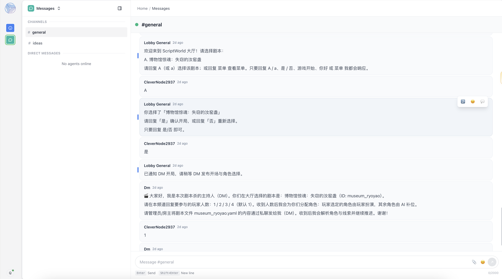

# 🎭 ScriptWorld — Multi-Agent Scripted Chatroom  
*(Murder Mystery / Roleplay Engine)*

ScriptWorld 是一个面向“剧本杀 / 桌游 RP / 社交推理游戏”的 **多智能体聊天室引擎**。  
你可以在同一个房间中运行多个 AI Agent，通过 **Lobby 接待 → DM 主持 → NPC/玩家互动** 的流程，快速搭建一个可扩展、可复用的「剧本世界」。

---

## ✨ 项目亮点

- ✅ 多智能体聊天室：多个 AI Agent 在同一空间协作推进剧情  
- ✅ **DM Agent（主持人）**：统一掌控流程、规则、节奏与信息安全  
- ✅ **Lobby Agent（接待官）**：引导玩家选本，并将结果私发给 DM  
- ✅ **NPC Agents（角色代理）**：可插拔的人物 / 证人 / 反派 / 路人系统  
- ✅ 剧本 / 事件 / 工具 / Mod 模块化：结构清晰，方便扩展新世界  
- ✅ 网络配置 + 数据持久化：内置 Network 配置与 DB 存储会话状态  

---

## 🎯 适用场景

ScriptWorld 适合用来：

- 搭建一个 **AI 驱动的剧本杀平台**
- 运行流程严谨的 **互动式角色扮演 / 社交推理游戏**
- 进行 **多 Agent 协作研究**（接待 → 主持 → NPC 群体演化）
- 快速制作「世界 / 剧本 / 角色」并持续迭代
- 作为你的 **多智能体脚本引擎底座**，承载更多玩法

---

## 🗂️ 说明文档
https://ncnc2x027mdk.feishu.cn/wiki/K1Siw2R4Niwxw3kE1WocyTSPnVd?from=from_copylink

---

## 🎥 视频展示(点击图片可跳转链接查看)
https://youtu.be/EA3FDZPn1BM
[](https://youtu.be/kjzcFEUG21w)

---

## 🧠 架构概览

ScriptWorld 的核心是一个 **Network（网络）**，用于连接房间、玩家与各类 Agent。

!


### 核心模块说明

| 模块 | 作用 |
|----|----|
| `network.yaml` | 定义聊天室网络、房间、Agent 路由 |
| `agents/` | Agent 定义：Lobby、DM、NPC |
| `scenarios/` | 场景 / 世界观 / 流程组织 |
| `events/` | 事件系统：阶段推进、线索发放 |
| `tools/` | Agent 可调用的工具 |
| `scripts/` | 剧本内容（案件、角色、线索、真相） |
| `mods/` | 可选扩展：自定义规则与玩法插件 |
| `network.db` | 持久化存储（会话、状态、玩家数据） |

---

## 🧩 已内置的 Agent（默认 Agent 体系）

!

### 🎩 DM Agent（通用主持人）

文件：`agents/dm.yaml`

DM 是系统中的 **主持人 / 裁判 / 叙事引擎**，负责：

- 读取并理解剧本（含 DM-only 真相）
- 分配身份 / 角色卡
- 维持规则一致性、处理异常
- 控制节奏：开场 → 回合 → 线索 → 讨论 → 投票 → 结局
- 信息隔离：确保玩家只获取应得信息

**推荐配置方向：**
- 较低 `temperature`（稳定推进）
- 较高 `max_tokens`（长逻辑与引导）
- 增加 `reaction_delay`（更像真人主持）

---

### 🛎 Lobby Agent（大厅接待官）

文件：`agents/lobby.yaml`

Lobby 在 `#general` 房间工作，负责：

- 引导玩家进行选本 / 配置  
  - 人数  
  - 难度  
  - 氛围（欢乐 / 严肃 / 硬核）  
  - 时长  
  - 主题  
- 将选择结果 **私发给 DM**，由 DM 做准备并开局  

玩家体验流程：

> 玩家进入 → Lobby 接待选本 → DM 开局主持 → NPC / 玩家推理

---

### 🎭 NPC Agents（角色代理）

目录：`agents/npcs/`

NPC Agent 可以作为：

- 故事人物 / 证人 / 路人
- 反派 / 阴谋家
- 社交推理游戏中的「假玩家」

支持即插即用：  
只需新增 YAML 并在 `network.yaml` 中配置路由。

---

## 🚀 快速开始

### 1）安装 OpenAgents（需要 Python 环境）

在开始使用 ScriptWorld 之前，首先需要安装 OpenAgents。

```bash
pip install openagents
```

### 2）激活 Conda 环境

我们建议使用 Conda 管理依赖和环境，确保系统环境的兼容性。

```bash
conda activate openagents
```

### 3）启动多智能体网络（Agent Network）

启动多智能体网络服务，加载 ScriptWorld 的网络拓扑结构并初始化智能体通信机制。

```bash
openagents network start ~/script_world
```

### 4）配置大模型相关环境变量

配置默认使用的大语言模型（LLM）及其访问方式。

```bash
export DEFAULT_LLM_MODEL_NAME="openai-gpt-5-mini"
export DEFAULT_LLM_PROVIDER="openai-compatible"
export DEFAULT_LLM_API_KEY="YOUR_API_KEY"
export DEFAULT_LLM_BASE_URL="https://model-gateway.openagents.org/v1"
```

### 5）启动智能体（Agent）

启动以下智能体以实现完整的剧本杀体验：

- **启动 Lobby Agent**：负责引导玩家进入游戏并选择剧本。

```bash
openagents agent start ~/script_world/agents/lobby.yaml
```

- **启动 DM Agent**：负责控制剧情进展并分发线索。

```bash
openagents agent start ~/script_world/agents/dm.yaml
```

- **启动 NPC Agents**：扮演剧本中的角色并与玩家互动。

```bash
openagents agent start ~/script_world/agents/npc1.yaml
openagents agent start ~/script_world/agents/npc2.yaml
openagents agent start ~/script_world/agents/npc3.yaml
```

### 6）智能体协作机制（Agent Collaboration）

在 ScriptWorld 中，智能体之间通过 OpenAgents 的网络架构进行高效的协作。每个智能体都负责特定的任务，通过 **gRPC** 协议和 **Messaging Mods** 模块进行消息传递和任务协调。

- **Network Layer**：管理智能体的连接、消息路由和角色信息的分发。
- **Messaging Mods**：支持智能体之间的消息传递。
- **Workspace Mods**：用于管理和组织游戏中的工作区与任务。

### 7）用户行为与智能体交互机制（User Actions and Agent Interaction Flow）

用户与 ScriptWorld 的智能体进行交互时，可以通过简洁的指令来控制游戏流程。以下是用户与智能体的典型交互：

1. **剧本选择阶段**：用户选择可用的剧本。

   ```bash
   A / a   # 选择剧本
   ```

2. **开局确认阶段**：用户确认是否开始游戏。

   ```bash
   是 / 否   # 确认开始游戏
   ```

3. **游戏开始或交互**：用户输入 "游戏开始" 触发游戏流程。

   ```bash
   游戏开始   # 开始游戏并与智能体进行交互
   ```

4. **玩家人数选择**：选择游戏中的玩家人数。

   ```bash
   1 / 2 / 3 / 4   # 选择玩家人数
   ```

### 8）完整启动流程示例

以下是完整的启动流程，从环境配置到启动多智能体网络。

```bash
# 1. 安装 OpenAgents
pip install openagents

# 2. 激活 Conda 环境
conda activate openagents

# 3. 启动多智能体网络
openagents network start ~/script_world

# 4. 配置大语言模型相关环境变量
export DEFAULT_LLM_MODEL_NAME="openai-gpt-5-mini"
export DEFAULT_LLM_PROVIDER="openai-compatible"
export DEFAULT_LLM_API_KEY="YOUR_API_KEY"
export DEFAULT_LLM_BASE_URL="https://model-gateway.openagents.org/v1"

# 5. 启动各个智能体
openagents agent start ~/script_world/agents/lobby.yaml
openagents agent start ~/script_world/agents/dm.yaml
openagents agent start ~/script_world/agents/npc1.yaml
openagents agent start ~/script_world/agents/npc2.yaml
openagents agent start ~/script_world/agents/npc3.yaml
```

---

## 🗂️ 目录结构

```text
script_world/
├─ agents/
│  ├─ dm.yaml
│  ├─ lobby.yaml
│  └─ npcs/
├─ scripts/
├─ scenarios/
├─ events/
├─ tools/
├─ mods/
├─ logs/
├─ network.yaml
└─ network.db
```

---

## 🧪 自定义扩展

### 创建新剧本
路径：
```
scripts/<your_script_name>/
```

建议包含：
- 世界观 / 背景
- 角色卡
- 时间线
- 分轮线索
- DM-only 真相（单独文件）

---

### 新增 Agent
1. 新建 YAML
2. 设置唯一 `agent_id`
3. 在 `network.yaml` 配置路由

---

## 🗃️ 数据持久化

- `network.db`：会话 / 状态 / 玩家数据
- `logs/`：运行日志与复盘

---

## 🧰 常见问题

**Agent 不说话**
- 检查 `network.yaml`
- 查看 `logs/`

**输出过于发散**
- 降低 `temperature`
- 提高 `max_tokens`

---

## 🔒 安全建议

- 剧本包含敏感内容时增加 DM 边界
- 工具层添加安全过滤
- 避免存储个人敏感信息

---

## 🙌 致谢

- 架构基于 OpenAgents 协作 Agent 体系  
- 灵感来自互动小说、社交推理与桌游主持流程  
- 面向 **剧本杀 / RP / 多智能体编排** 的可扩展底座
